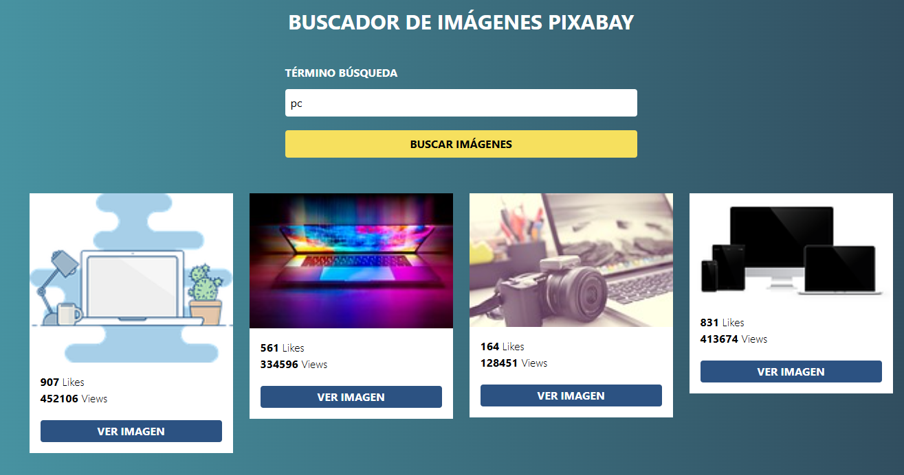
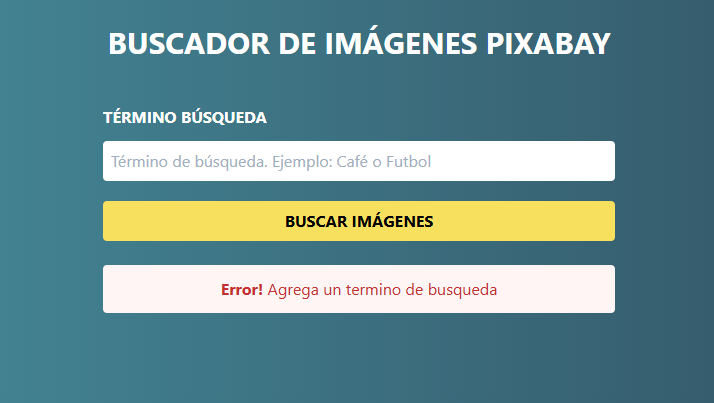
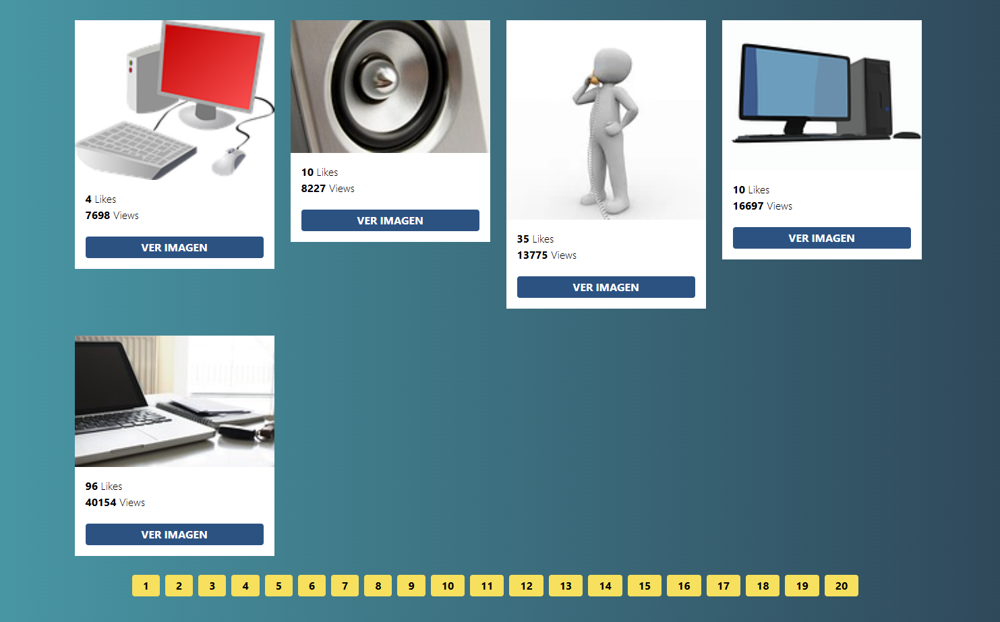

# Buscador de imageens utilizando la API de Pixabay
Muestra imagenes segun el termino escrito al buscar
======================

======================

======================

======================

======================
Test: Necesitas una API Key para utilizar el buscador: https://pixabay.com/